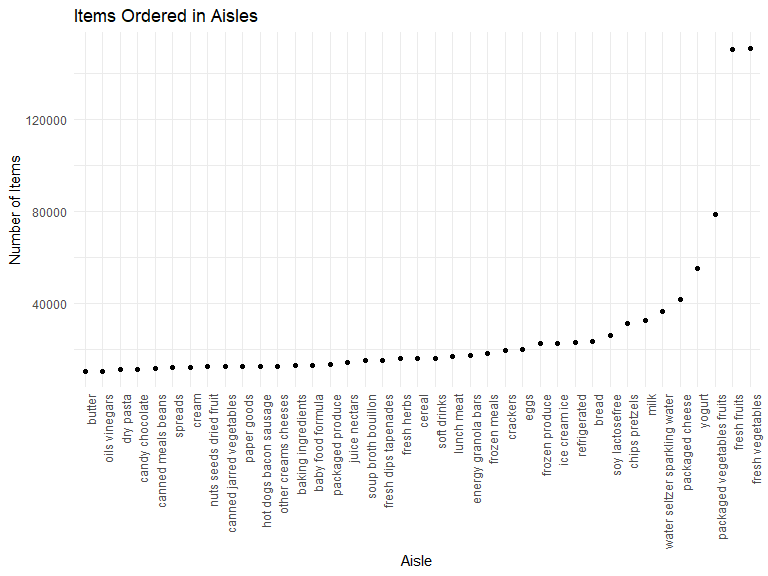

Homework 3
================
Alexis
10/7/2019

## Problem 1

The goal is to do some exploration of this dataset. To that end, write a
short description of the dataset, noting the size and structure of the
data, describing some key variables, and giving illstrative examples of
observations. Then, do or answer the following (commenting on the
results of each):

``` r
data("instacart")
```

There are 1384617 total observations in this dataset of 131209 unique
users and 15 variables. Character variables include `eval_set`,
`product_name`, `aisle`, and `department`, and the rest of the variables
in the dataset are numeric. The average hour of the day that each
product was ordered was hour 13.5775922, while the median day of the
week of each product was ordered was day 3.

Example: Order id \#1 has a user id of 112108 and this was their fourth
order on Instacart. They ordered this at 10am and ordered eight products
such as Bulgarian Yogurt and organic celery hearts. We can also
determine the department and aisle from which each product came from. We
can also tell it’s been 9 days since their previous order.

``` r
instacart %>%
  filter(order_id == 1)
```

    ## # A tibble: 8 x 15
    ##   order_id product_id add_to_cart_ord~ reordered user_id eval_set
    ##      <int>      <int>            <int>     <int>   <int> <chr>   
    ## 1        1      49302                1         1  112108 train   
    ## 2        1      11109                2         1  112108 train   
    ## 3        1      10246                3         0  112108 train   
    ## 4        1      49683                4         0  112108 train   
    ## 5        1      43633                5         1  112108 train   
    ## 6        1      13176                6         0  112108 train   
    ## 7        1      47209                7         0  112108 train   
    ## 8        1      22035                8         1  112108 train   
    ## # ... with 9 more variables: order_number <int>, order_dow <int>,
    ## #   order_hour_of_day <int>, days_since_prior_order <int>,
    ## #   product_name <chr>, aisle_id <int>, department_id <int>, aisle <chr>,
    ## #   department <chr>

  - How many aisles are there, and which aisles are the most items
    ordered from?

There are 134 aisles. The aisles most items are ordered from are fresh
vegetables, fresh fruits, and packaged vegetables fruits

``` r
instacart %>%
  count(aisle) %>%
  arrange(desc(n))
```

    ## # A tibble: 134 x 2
    ##    aisle                              n
    ##    <chr>                          <int>
    ##  1 fresh vegetables              150609
    ##  2 fresh fruits                  150473
    ##  3 packaged vegetables fruits     78493
    ##  4 yogurt                         55240
    ##  5 packaged cheese                41699
    ##  6 water seltzer sparkling water  36617
    ##  7 milk                           32644
    ##  8 chips pretzels                 31269
    ##  9 soy lactosefree                26240
    ## 10 bread                          23635
    ## # ... with 124 more rows

  - Make a plot that shows the number of items ordered in each aisle,
    limiting this to aisles with more than 10000 items ordered. Arrange
    aisles sensibly, and organize your plot so others can read it.

<!-- end list -->

``` r
instacart %>%
  group_by(aisle) %>%
  count(aisle) %>%
  filter(n > 10000) %>%
  ggplot(aes(x = reorder(aisle, n), y = n)) +
  geom_point() +
  labs(
    title = "Items Ordered in Aisles",
    x = "Aisle",
    y = "Number of Items"
    ) +
  theme(legend.position = "none") +
  theme(axis.text.x = element_text(angle = 90, hjust = 1)) 
```



  - Make a table showing the three most popular items in each of the
    aisles “baking ingredients”, “dog food care”, and “packaged
    vegetables fruits”. Include the number of times each item is ordered
    in your table.

<!-- end list -->

``` r
instacart %>%
  filter(aisle == c("baking ingredients", "dog food care", "packaged vegetables fruits")) %>%
  select(product_name, aisle) %>%
  group_by(aisle) %>%
  count(product_name) %>%
  arrange(desc(n, aisle)) %>% 
  top_n(3, n) %>% 
  knitr::kable()
```

| aisle                      | product\_name                                   |    n |
| :------------------------- | :---------------------------------------------- | ---: |
| packaged vegetables fruits | Organic Baby Spinach                            | 3324 |
| packaged vegetables fruits | Organic Raspberries                             | 1920 |
| packaged vegetables fruits | Organic Blueberries                             | 1692 |
| baking ingredients         | Light Brown Sugar                               |  157 |
| baking ingredients         | Pure Baking Soda                                |  140 |
| baking ingredients         | Organic Vanilla Extract                         |  122 |
| dog food care              | Organix Grain Free Chicken & Vegetable Dog Food |   14 |
| dog food care              | Organix Chicken & Brown Rice Recipe             |   13 |
| dog food care              | Original Dry Dog                                |    9 |

  - Make a table showing the mean hour of the day at which Pink Lady
    Apples and Coffee Ice Cream are ordered on each day of the week;
    format this table for human readers (i.e. produce a 2 x 7 table)

<!-- end list -->

``` r
instacart %>%
  filter(
      product_name == c("Pink Lady Apples", 
                        "Coffee Ice Cream")) %>%
  select(
    order_dow, order_hour_of_day, product_name) %>%
  group_by(
    product_name, order_dow) %>%
  summarize(
    mean_hour = mean(order_hour_of_day)) %>%
     mutate(
      order_dow =
        recode(order_dow, 
            "0" = "Sunday" , "1" = "Monday",
            "2" = "Tuesday", "3" = "Wednesday",
            "4" = "Thursday", "5" = "Friday",
            "6" = "Saturday"),
    mean_hour = round(mean_hour, digits = 2)) %>%
  pivot_wider(
    names_from = order_dow,
    values_from = mean_hour) %>%
  knitr::kable()
```

| product\_name    | Sunday | Monday | Tuesday | Wednesday | Thursday | Friday | Saturday |
| :--------------- | -----: | -----: | ------: | --------: | -------: | -----: | -------: |
| Coffee Ice Cream |  13.22 |  15.00 |   15.33 |     15.40 |    15.17 |  10.33 |    12.35 |
| Pink Lady Apples |  12.25 |  11.68 |   12.00 |     13.94 |    11.91 |  13.87 |    11.56 |
